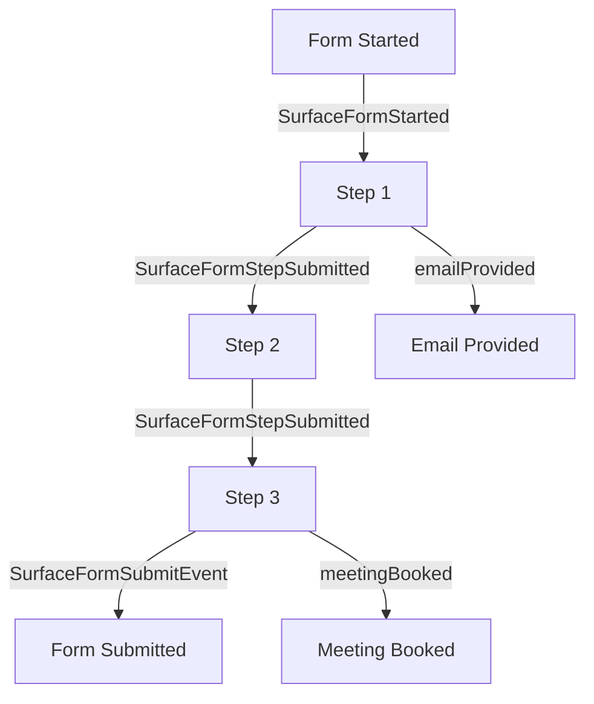

## Overview

Surface forms emit various events that can be tracked and used with analytics platforms like Google Ads and Meta Ads. This guide covers all available events and their associated data.

## Available Events
<Info>
  Note: The `emailProvided` and `meetingBooked` events are only emitted when the respective fields (email input or scheduler) are present in the form.
</Info>

<CardGroup cols={2}>
  <Card
    title="Form Started Event"
    icon="rocket"
    href="#form-started-event"
  >
    Track when users begin filling out a form
  </Card>
    <Card
    title="Step Completion Event"
    icon="chart-bar"
    href="#step-completion-event"
  >
    Monitor individual step completions in multi-step forms
  </Card>
  <Card
    title="Email Provided Event"
    icon="envelope"
    href="#email-provided-event"
  >
    Track when users provide their email address
  </Card>
  <Card
    title="Meeting Booked Event"
    icon="calendar"
    href="#meeting-booked-event"
  >
    Track when users book a meeting through the form
  </Card>
  <Card
    title="Form Submission Event"
    icon="paper-plane"
    href="#form-submission-event"
  >
    Track when a form is successfully submitted
  </Card>
</CardGroup>

### Form Started Event
<Frame>
 
</Frame>
When a user starts filling out a form, the `SurfaceFormStarted` event is emitted.

### Step Completion Event
<Frame>
 
</Frame>
Each time a user completes a step in a multi-step form, the `SurfaceFormStepSubmitted` event is emitted.

### Email Provided Event
<Frame>
 
</Frame>
When a user provides their email address, the `SurfaceFormEmailProvided` event is emitted.

### Meeting Booked Event
<Frame>
 
</Frame>
When a user books a meeting through the form, the `SurfaceFormMeetingBooked` event is emitted.

### Form Submission Event
<Frame>
 
</Frame>
When a user submits a form, the `SurfaceFormSubmitEvent` event is emitted.

## Event Flow in Multi-Step Forms

The following diagram shows how events are emitted in a typical multi-step form:

