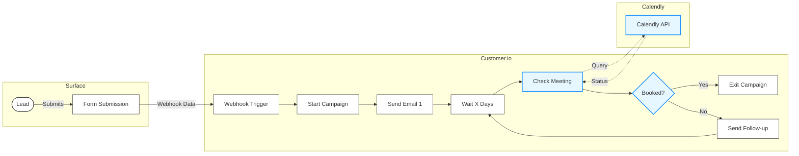

This guide shows you how to run customizable email sequences with **Customer.io** and **Calendly** when leads submit your Surface form—whether they complete it or drop off partway through. The sequence automatically exits when a lead books a meeting, so you never over-email someone who has already scheduled a call.

## How It Works

<Steps>
  <Step title="Form submission">
    A lead submits your Surface form (partial or completed). Surface sends a
    webhook to the appropriate Customer.io URL based on the trigger.
  </Step>
  <Step title="Person & event">
    Two webhook-triggered campaigns in Customer.io (one for partial, one for
    completed) create or update the person and add the appropriate event.
  </Step>
  <Step title="Email sequence">
    An event-triggered campaign starts a customizable follow-up email sequence
    with delays between each email.
  </Step>
  <Step title="Meeting check">
    Before each follow-up (after the first), a webhook checks the Calendly API.
    If the lead has booked a meeting, the campaign exits. Otherwise, it
    continues.
  </Step>
</Steps>

## Prerequisites

Before you begin, make sure you have:

- A **Surface** account with a form that supports partial submissions (e.g., multi-step form with email capture)
- A **Customer.io** account with Campaigns and Journeys access
- A **Calendly** account with API access (Personal Access Token or OAuth)
- Your Calendly event type URI for the meeting type you want to check

## Setup Steps

<CardGroup cols={2}>
  <Card
    title="Step 1: Webhook Trigger Campaigns"
    icon="webhook"
    href="/guides/email-sequences-customerio-calendly/step-1-webhook-trigger"
  >
    Create two webhook-triggered campaigns in Customer.io—one for partial and one for completed—each with its own URL
  </Card>

<Card
  title="Step 2: Configure Surface Workflow"
  icon="diagram-project"
  href="/guides/email-sequences-customerio-calendly/step-2-surface-workflow"
>
  Set up the Surface Workflow Builder to send form data to the correct
  Customer.io webhook URL based on trigger path (Dropped Off or Form Submission)
</Card>

<Card
  title="Step 3: Event-Based Email Campaigns"
  icon="envelope"
  href="/guides/email-sequences-customerio-calendly/step-3-event-campaigns"
>
  Create two event-triggered campaigns—one for partial submissions and one for
  completed—with your follow-up emails and delays
</Card>

  <Card
    title="Step 4: Calendly Meeting Check"
    icon="calendar-check"
    href="/guides/email-sequences-customerio-calendly/step-4-calendly-check"
  >
    Add a webhook node before each follow-up (after the first) to check if the lead booked a meeting and exit the campaign if so
  </Card>
</CardGroup>

## Campaign Flow Diagram

