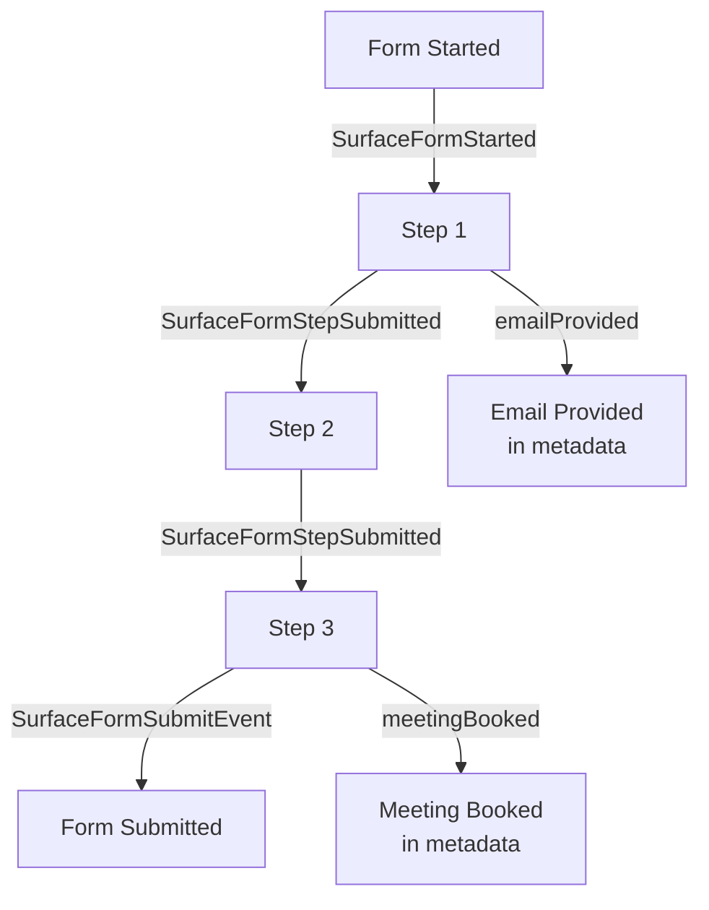

## Overview

Surface forms emit various events that can be tracked and used with analytics platforms like Google Ads and Meta Ads. This guide covers all available events and their associated data.

## Available Events
<Info>
  Note: The `emailProvided` and `meetingBooked` events are only emitted when the respective fields (email input or scheduler) are present in the form.
</Info>

<CardGroup cols={2}>
  <Card
    title="Form Started Event"
    icon="rocket"
    href="#form-started-event"
  >
    Track when users begin filling out a form
  </Card>
    <Card
    title="Step Completion Event"
    icon="chart-bar"
    href="#step-completion-event"
  >
    Monitor individual step completions in multi-step forms
  </Card>
  <Card
    title="Form Submission Event"
    icon="paper-plane"
    href="#form-submission-event"
  >
    Track when a form is successfully submitted
  </Card>
</CardGroup>

### Form Started Event
<CardGroup cols={2}>
  <Card>
    <Frame>
      
    </Frame>
  </Card>
  <Card>
    <Frame caption="GTM example">
      
    </Frame>
  </Card>
</CardGroup>
When a user starts filling out a form, the `SurfaceFormStarted` event is emitted.

### Step Completion Event
<CardGroup cols={2}>
  <Card>
    <Frame>
      
    </Frame>
  </Card>
  <Card>
    <Frame caption="GTM example">
      
    </Frame>
  </Card>
</CardGroup>
Each time a user completes a step in a multi-step form, the `SurfaceFormStepSubmitted` event is emitted.

<Tip>
  If the step includes an email input or a scheduler component, the event's metadata will include `emailProvided` or `meetingBooked` variables, respectively. 
    There are no separate events for email provided or meeting booked—these are tracked as part of the step submission event.
</Tip>

### Form Submission Event
<Frame>
 
</Frame>
When a user submits a form, the `SurfaceFormSubmitEvent` event is emitted.

## Event Flow in Multi-Step Forms

The following diagram shows how events are emitted in a typical multi-step form:

