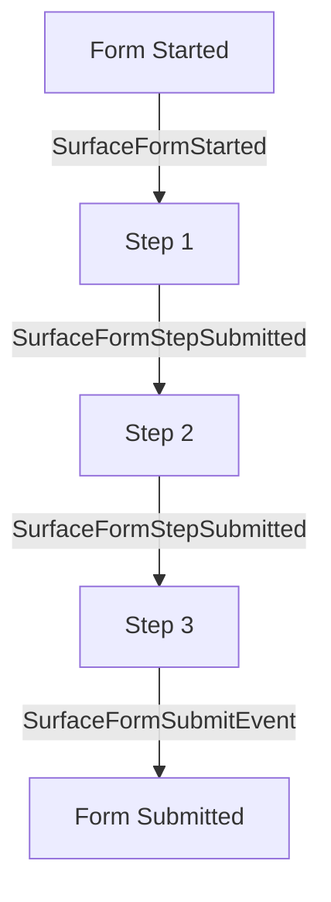

## Overview

Surface forms emit various events that can be tracked and used with analytics platforms like Google Ads and Meta Ads. This guide covers all available events and their associated data.

## Available Events

<CardGroup cols={2}>
  <Card
    title="Form Started Event"
    icon="rocket"
    href="#form-started-event"
  >
    Track when users begin filling out a form
  </Card>
    <Card
    title="Step Completion Event"
    icon="chart-bar"
    href="#step-completion-event"
  >
    Monitor individual step completions in multi-step forms
  </Card>
  <Card
    title="Form Submission Event"
    icon="paper-plane"
    href="#form-submission-event"
  >
    Track when a form is successfully submitted
  </Card>
</CardGroup>

### 1. SurfaceFormStarted
When a user starts filling out a form, the `SurfaceFormStarted` event is emitted.
<Frame>
 
</Frame>

### 2. SurfaceFormStepSubmitted
Each time a user completes a step in a multi-step form, the `SurfaceFormStepSubmitted` event is emitted.

<Info>
  Note: The `SurfaceFormStepSubmitted` emits value of `emailProvided` and `meetingBooked` in metadata when the respective fields (email input or scheduler) are present in the form.
  
  ```json
  {
    "emailProvided": true,
    "meetingBooked": true
  }
  ```
  
</Info>

<Frame>
 
</Frame>

### 3. SurfaceFormSubmitEvent
When a user submits a form, the `SurfaceFormSubmitEvent` event is emitted.
<Frame>
 
</Frame>

## Event Flow in Multi-Step Forms

The following diagram shows how events are emitted in a typical multi-step form:

<Frame>

</Frame>